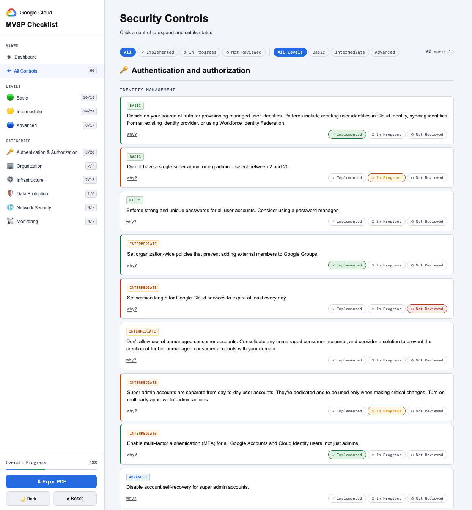

# Google Cloud MVSP Checklist
A self-contained, single-file web app for tracking your organisation's progress against the [Google Cloud Minimum Viable Secure Platform (MVSP)](https://cloud.google.com/security/minimum-viable-secure-platform) checklist. GCMVSP is a free, opinionated, 60-point checklist to establish a foundational security baseline on Google Cloud. It acts as a "quick start guide", backed by Terraform code for easy automation.

## ✨ Features
* 60 controls across `Authentication & Authorization`, `Organization`, `Infrastructure`, `Data Protection`, `Network Security`, and `Monitoring` domains
* 3 status states per control — `Implemented`, `In Progress`, `Not Reviewed`
* Live dashboard with progress charts by `Level`, `Category`, and `Sub-category`
* Filters by status and level (`Basic` / `Intermediate` / `Advanced`)
* Sidebar navigation with real-time reviewed/total badges for all Levels and Categories
* Notes per control, saved instantly as you type
* PDF export capturing all statuses, notes, and dashboard charts
* Light & dark mode with preference saved to localStorage
* Zero dependencies — no backend, no build step, no database

> **Note:** State is held in memory and resets on page reload. For persistent tracking across sessions, consider wrapping this in a lightweight backend, or exporting to PDF regularly.

## 🚀 Dashboard

